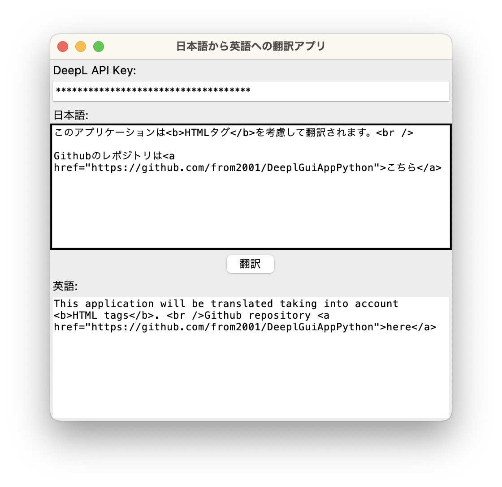

# DeeplGuiAppPython  


## 概要  
DeepL APIを用いて日本語を英語に翻訳することのできるGUIアプリケーションです。ChatGPTを用いたアプリケーション開発の練習を兼ねて1時間程度で開発したものです。

## 特徴  
  - HTMLやXMLのタグを考慮して翻訳してくれます。この処理はDeepL公式のウェブ版やアプリ版では実現できません。
  - コードはすべてChatGPTに書いてもらいました。

## 実行方法  
1. 任意のフォルダにコードをCloneまたはダウンロードした後  
1. 必要モジュールをインストールする  
```pip install -r requirements.txt```
1. 実行する  
```python DeeplGuiApp.py```

## その他  
 - 入力したAPI KEYはapi_key.txtに保存されます  

## ChatGPT会話履歴
 - [こちら](ChatGPT_Conversation.md)


